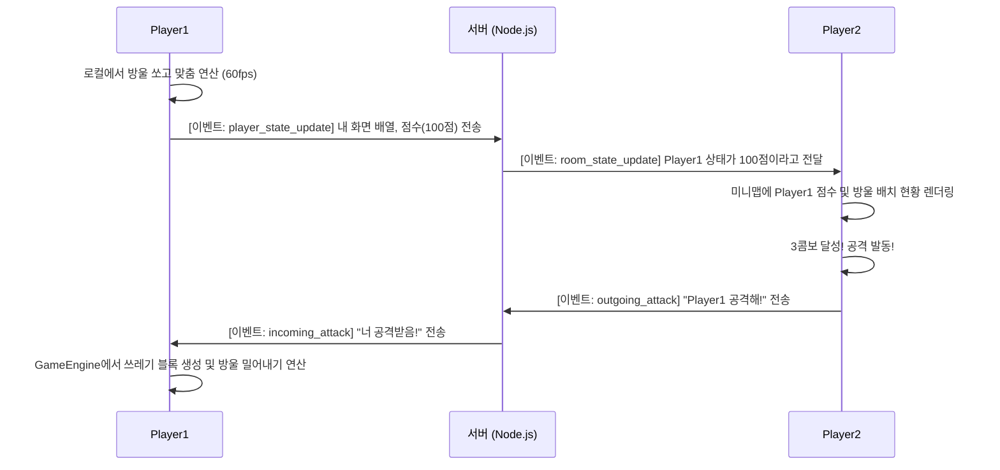

# 🎮 단축키 마스터 (Shortcut Master) - 기술 명세 및 시스템 아키텍처 가이드

본 문서는 **"단축키 마스터(Shortcut Master)"** 프로젝트의 모든 것을 담은 공식 기술 및 기획 문서입니다. 개발 환경, 게임 로직, 시스템 아키텍처, 네트워크 동기화 방식, 그리고 코드 레벨의 상세한 구현 방법까지 초보 개발자도 완벽하게 이해할 수 있도록 아주 구체적으로 작성되었습니다.

---

## 1. 프로젝트 개요 (Project Overview)

"단축키 마스터"는 고전적인 **버블 슈터(Bubble Shooter)** 게임 메커니즘에 **키보드 단축키(Shortcuts) 학습 시스템**을 결합한 웹 기반 멀티플레이어 아케이드 게임입니다.
단순히 방울을 터뜨리는 것을 넘어, 프로그래밍이나 오피스 작업에서 필수적인 단축키(예: `Ctrl + C`, `Ctrl + V`)를 게임을 통해 자연스럽게 학습하도록 돕는 것이 주요 목적입니다.

> **버블 슈터(Bubble Shooter) 메커니즘**:
> 화면 상단에 매달려 있는 여러 색상의 방울들을 향해, 화면 하단에서 새로운 방울을 쏘아 올려 같은 색상(혹은 같은 속성)의 방울을 3개 이상 연결하여 파괴하는 퍼즐 게임 장르입니다.
> ```javascript
> // 버블 슈터의 핵심 판정 예시 (JavaScript)
> if (connectedBubbles.length >= 3) {
>   popBubbles(connectedBubbles); // 3개 이상 연결되면 터뜨림
> }
> ```

이 게임은 단순히 혼자 즐기는 **싱글 플레이**뿐만 아니라, 가상의 봇과 대결하는 **AI 대전**, 그리고 서버를 통해 다른 유저와 실시간으로 대결하는 **멀티플레이어** 모드를 지원합니다.

---

## 2. 시스템 아키텍처 및 기술 스택 (Tech Stack & Architecture)

이 프로젝트는 최신 웹 개발 트렌드를 반영하여 설계되었습니다.

### 2.1 프론트엔드 (Frontend / Client-side)

프론트엔드는 사용자가 직접 보고 상호작용하는 영역입니다.

- **Framework (프레임워크)**: React 18
  > **React**: 페이스북(Meta)에서 만든 사용자 인터페이스(UI) 구축용 자바스크립트 라이브러리입니다. 화면의 각 부분을 '컴포넌트(Component)'라는 조각으로 나누어 레고 블록처럼 조립할 수 있게 해줍니다.
  > ```tsx
  > // React 컴포넌트 실사용 예시
  > function BubbleShooterApp() {
  >   return (
  >     <div>
  >       <ScoreBoard score={100} />
  >       <GameCanvas />
  >     </div>
  >   );
  > }
  > ```

- **Language (언어)**: TypeScript
  > **TypeScript**: 자바스크립트에 '타입(Type)'을 부여한 언어입니다. 변수에 들어갈 데이터의 종류를 미리 정해두어, 프로그램이 실행되기 전에 오타나 잘못된 데이터 사용에 의한 치명적인 버그를 잡아줍니다.
  > ```typescript
  > // TypeScript 실사용 예시
  > interface PlayerData {
  >   name: string;
  >   score: number;
  > }
  > function updateScore(player: PlayerData) {
  >   // player.score가 숫자가 아니면 코드 작성 중 에러를 띄움
  > }
  > ```

- **Styling (스타일링)**: Tailwind CSS
  > **Tailwind CSS**: 별도의 CSS 파일을 길게 작성할 필요 없이, HTML(또는 JSX) 태그 안에 `class="bg-blue-500 text-white"`처럼 미리 정의된 유틸리티 클래스를 적어 넣기만 하면 디자인이 완성되는 기술입니다.
  > ```tsx
  > // Tailwind CSS 실사용 예시
  > <button className="bg-blue-500 hover:bg-blue-700 text-white font-bold py-2 px-4 rounded">
  >   게임 시작
  > </button>
  > ```

- **Rendering Engine (렌더링 엔진)**: HTML5 Canvas API
  > **HTML5 Canvas API**: 브라우저에서 화면을 그릴 때 HTML 태그(`div`, `img` 등)를 여러 개 생성하지 않고, 하나의 커다란 도화지(Canvas)를 깔아놓고 자바스크립트를 이용해 픽셀 단위로 직접 그림을 그리는 방식입니다. 초당 60번씩 화면이 변하는 게임에서는 일반 HTML 태그 방식보다 압도적으로 속도가 빠르고 부드럽습니다.
  > ```javascript
  > // Canvas API 실사용 예시
  > const canvas = document.getElementById('myCanvas');
  > const ctx = canvas.getContext('2d');
  > ctx.fillStyle = 'blue';
  > ctx.beginPath();
  > ctx.arc(100, 100, 20, 0, Math.PI * 2); // (100, 100) 위치에 반지름 20의 파란 원(방울)을 그림
  > ctx.fill();
  > ```

### 2.2 백엔드 (Backend / Server-side)

백엔드는 여러 플레이어를 서로 연결해주고 점수를 중계하는 보이지 않는 처리 공간입니다.

- **Framework (프레임워크)**: Node.js 기반의 Express.js
  > **Node.js와 Express.js**: Node.js는 브라우저 밖에서도 자바스크립트를 실행할 수 있게 해주는 환경이며, Express.js는 그 위에서 웹 서버를 아주 쉽게 만들 수 있도록 도와주는 도구입니다.
  > ```javascript
  > // Express.js 실사용 예시
  > const express = require('express');
  > const app = express();
  > app.get('/', (req, res) => {
  >   res.send('단축키 마스터 서버가 가동 중입니다.');
  > });
  > app.listen(3000);
  > ```

- **Network Communication (네트워크 통신)**: Socket.io
  > **Socket.io (웹소켓)**: 일반적인 웹사이트(HTTP)는 유저가 클릭해야만 서버가 응답하지만, 웹소켓은 한 번 연결해두면 파이프가 뚫린 것처럼 양쪽에서 언제든 실시간으로 데이터를 주고받을 수 있습니다. 멀티플레이어 게임의 핵심 기술입니다.
  > ```javascript
  > // Socket.io 실사용 예시 (서버 측)
  > io.on('connection', (socket) => {
  >   // 누군가 접속하면 실행
  >   console.log('유저 접속:', socket.id);
  >   // 다른 유저가 공격했을 때 해당 플레이어에게 즉각 전달
  >   socket.on('attack', (targetId) => {
  >     io.to(targetId).emit('receive_attack', 10); // 타겟에게 10 데미지 전송
  >   });
  > });
  > ```

---

## 3. 프론트엔드 핵심 구조 및 데이터 흐름

단축키 마스터의 화면은 여러 개의 React 컴포넌트들로 이루어져 있습니다. 이 컴포넌트들은 각자의 역할을 수행하며, `GameEngine.ts`라는 두뇌(클래스)를 통해 통제됩니다.

### 3.1 주요 아키텍처 흐름 다이어그램

```mermaid
graph TD
    A[App.tsx (메인 진입점)] --> B{모드 선택}
    B -->|싱글 플레이| C[SinglePlayerView.tsx]
    B -->|멀티 플레이| D[MultiplayerView.tsx]
    C --> E[GameCanvas.tsx]
    D --> E
    D --> F[MiniGameCanvas.tsx (상대방 화면)]
    E <--> G((GameEngine.ts))
    G <--> H[Bubble.ts]
    G <--> I[ShortcutTable.ts (단축키 사전)]
    G -.-> J[Socket.io (서버 동기화)]
```

> **Mermaid 다이어그램**: 텍스트 코드를 분석하여 플로우 차트나 구조도로 변환해주는 도구입니다. 위 다이어그램은 최상위 컴포넌트인 `App`에서 `GameEngine`과 `Socket`까지 데이터가 어떻게 흘러가는지를 화살표로 직관적으로 보여줍니다.

---

## 4. 핵심 게임 알고리즘 (Core Algorithms)

게임이 렉 없이 부드럽게 돌아가기 위해서는 뒷단에서 매우 정교한 수학적, 논리적 연산(알고리즘)이 쉼 없이 실행되어야 합니다.

### 4.1 게임 루프 (Game Loop)

초당 60프레임(60 FPS)을 유지하기 위해 자바스크립트의 내장 함수인 `requestAnimationFrame`을 사용합니다. 
이는 모니터의 주사율에 맞춰 가장 부드러운 타이밍에 화면을 다시 그리라고 브라우저에 명령하는 기술입니다.

> **requestAnimationFrame**: `setInterval`이나 `setTimeout`보다 화면 그리기(렌더링)에 훨씬 최적화된 방법으로, 브라우저가 다른 탭에 있을 때는 연산을 멈춰 배터리와 CPU 자원을 절약해줍니다.
> ```typescript
> // 게임 루프 실사용 예시 (GameEngine.ts 내부)
> function loop() {
>   update(); // 1. 방울들의 위치와 물리 법칙(속도, 충돌) 계산
>   draw();   // 2. 캔버스를 다 지우고 새로운 위치에 방울 그리기
>   requestAnimationFrame(loop); // 3. 다음 프레임에 또 이 함수를 실행 예약
> }
> requestAnimationFrame(loop); // 최초 시작
> ```

### 4.2 충돌 감지 및 헥사고날 스냅 (Hexagonal Snapping)

발사한 버블이 상단의 버블 더미나 천장에 닿았는지 판정하려면 **유클리디안 거리 공식(피타고라스의 정리)**이 사용됩니다.

> **유클리디안 거리 공식**: 공간 상의 두 점 사이의 최단 거리를 구하는 수학 공식입니다. 게임에서는 날아가는 A 방울의 중심과 멈춰있는 B 방울의 중심 거리를 구한 후, 그 거리가 두 방울의 반지름의 합보다 작아지면 "충돌(부딪혔다)"로 인식합니다.
> ```typescript
> // 충돌 판정 예시
> const dx = movingBubble.x - targetBubble.x;
> const dy = movingBubble.y - targetBubble.y;
> const distance = Math.sqrt(dx * dx + dy * dy); // 피타고라스의 정리
> if (distance < (BUBBLE_RADIUS * 2)) {
>   // 거리가 지름보다 짧아졌으므로 충돌 발생!
>   handleCollision();
> }
> ```

충돌이 감지되면, 날아가던 버블이 허공에 멈추지 않고 마치 자석에 이끌리듯 정확한 육각형(벌집) 모양의 칸(Grid)으로 쏙 들어가야 합니다. 이를 **그리드 스냅(Grid Snapping)** 기술이라고 합니다.

### 4.3 버블 매칭 및 파괴 알고리즘 (BFS 탐색)

방울이 안착한 후, 이 방울과 똑같은 키(`Ctrl`, `C` 등)가 주변에 3개 이상 뭉쳐있는지, 혹은 단축키 세트가 완성되었는지 찾아야 합니다. 이때 가장 널리 쓰이는 인공지능 기초 탐색 알고리즘인 **BFS(너비 우선 탐색)**를 사용합니다.

> **BFS (Breadth-First Search, 너비 우선 탐색)**: 호수에 돌을 던졌을 때 물결이 퍼져나가는 것처럼, 중심점(방금 붙은 방울)에서 시작해 1칸 거리의 방울들을 모두 확인하고, 그 다음 2칸 거리의 방울들을 확인하는 식으로 똑같은 색상을 찾아나가는 수학적 기법입니다.
> ```typescript
> // BFS(너비 우선 탐색) 알고리즘 논리 흐름 예시
> function findMatches(startBubble) {
>   let queue = [startBubble];    // 탐색 예정 목록 (물결의 최전선)
>   let matched = [startBubble];  // 일치하는 방울 보관함
>   
>   while (queue.length > 0) {
>     let current = queue.shift(); // 목록 제일 앞 방울을 꺼냄
>     let neighbors = getNeighbors(current); // 주변 6방향 인접 방울 확인
>     
>     neighbors.forEach(neighbor => {
>       // 색상(텍스트)이 같고 아직 확인 안 한 방울이면 보관함과 예정 목록에 넣음
>       if (neighbor.text === current.text && !matched.includes(neighbor)) {
>         matched.push(neighbor);
>         queue.push(neighbor);
>       }
>     });
>   }
>   return matched; // 찾아낸 연결된 방울 꾸러미 반환
> }
> ```

---

## 5. 멀티플레이어 데이터 동기화 메커니즘 (Multiplayer Sync)

서버는 게임판의 모든 픽셀 이동을 계산하지 않습니다. 그렇게 하면 서버에 과부하가 걸립니다. 
대신 **Client-side Prediction (클라이언트 측 예측)** 이라는 기법을 사용하여, 각 유저의 컴퓨터(웹 브라우저)에서 물리 연산을 각자 알아서 수행하고, 서버에는 오직 "내 그리드 상황 배열 데이터", "내 점수", "콤보 횟수" 등 **초경량 압축 데이터만 1초에 수 차례 전송**합니다.



> **Client-side Prediction (클라이언트 측 예측)**: 멀티플레이 게임에서 서버의 답변을 기다리지 않고, 유저의 컴퓨터가 먼저 게임 결과를 스스로 계산해서 화면에 부드럽게 보여주는 기술입니다.
> ```javascript
> // 클라이언트가 서버로 상태를 보내는 Socket 코드 예시
> socket.emit("player_state_update", {
>   roomId: "room_123",
>   id: socket.id,
>   score: engine.score,
>   // 전체 방울 객체가 아닌 단순히 어떤 글자인지만 담은 아주 가벼운 배열을 전송
>   gridState: engine.getCompressedGrid() 
> });
> ```

---

## 6. 점수 산정 로직 및 콤보/미션 시스템

이 게임에서 가장 역동적인 요소는 단순히 터지는 것이 아닌, 콤보와 미션을 통한 점수 폭발입니다. 점수는 아래의 백엔드/프론트엔드 공유 룰(Rule)에 의해 엄격하게 산정됩니다.

### 6.1 기본 산정 방식
방울이 1개 파괴될 때 기본적으로 `10점`을 부여합니다.
`획득 점수 = (파괴된 방울 수) * 10점 * 배율`

### 6.2 배율 (Multiplier) 알고리즘
게이머의 실력을 구분하기 위해 두 가지 배율 시스템이 들어갑니다.

1. **콤보 배율 (Combo)**: 빗나가지 않고 연속으로 터뜨릴 때마다 배율이 10%씩 증가합니다.
   > **콤보 시스템 코드 예시**:
   > ```typescript
   > // 콤보 시 점수 증폭
   > comboCount += 1;
   > let comboMultiplier = 1.0 + (comboCount * 0.1); 
   > let finalScore = Math.floor(baseScore * comboMultiplier);
   > ```

2. **미션 단축키 보너스**: 중앙 화면에 크게 표시되는 "미션(예: `Ctrl + C` 만들기)"을 완벽하게 조합해서 터뜨리면, **x5 배율 (5배)**의 대폭발 보너스가 주어집니다.
   > **미션 처리 코드 예시**:
   > ```typescript
   > if (destroyedBubblesText === currentMission.combination) {
   >   finalScore *= 5;  // 점수 5배 증폭
   >   showMassiveBombEffect(); // 초대형 폭탄 이펙트 화면에 출력
   >   generateNewMission(); // 성공했으니 새로운 미션으로 갱신
   > }
   > ```

3. **고난이도 단축키 (3키 조합) 보너스**: `Ctrl + Shift + Esc` 처럼 3개의 키를 요구하는 어려운 단축키를 완성하면 **x6 배율 (6배)**이 적용되며, 상대방에게 엄청난 쓰레기 블록을 보내는 공격이 발동됩니다.

---

## 7. 승패 판정 로직 (Game Over Condition)

게임은 영원히 지속되지 않습니다. 긴장감을 유발하는 장치들이 존재합니다.

1. **천장 강하 (Ceiling Drop)**: 방울을 허공에 쏘거나, 연결되지 못하고 붙어버리기만 하는 '실패'를 일정 횟수(예: 5번) 반복하면, 갑자기 게임판 전체가 한 칸 아래로 쿵! 하고 내려옵니다.
2. **사망선(Dead-line) 판정**: 맨 아래에 위치한 방울이 화면 바닥 근처의 위험선(Dead-line Y좌표)을 뚫고 내려오면 즉시 게임 오버로 판정됩니다.

> **Dead-line 판정 코드 예시**:
> ```typescript
> function checkGameOver() {
>   for (let bubble of activeBubbles) {
>     if (bubble.y > DEADLINE_Y) {
>       isDead = true;
>       triggerGameOverUI(); // "GAME OVER" 화면 출력
>       return;
>     }
>   }
> }
> ```

멀티플레이 시에는 서버가 모든 유저의 `isDead` 상태를 실시간 감시합니다. 방에 4명이 있는데 3명의 상태가 `isDead = true`가 되면, 서버는 살아남은 단 1명을 승자(Winner)로 확정 짓고 방에 있는 모든 유저에게 승패 결과를 전송해 라운드를 끝냅니다.

---

## 8. 트러블슈팅 및 FAQ (FAQ & Troubleshooting)

개발 혹은 플레이 시 발생할 수 있는 주요 의문점 및 해결 방법입니다.

**Q. 화면이 버벅거리고 방울이 끊기면서 날아갑니다.**
- **A**: `requestAnimationFrame` 주기가 모니터 스펙 문제로 꼬였거나, 브라우저의 하드웨어 가속 설정이 꺼져 있을 가능성이 높습니다. 크롬 설정에서 '가능한 경우 하드웨어 가속 사용'을 켜주세요.
> **하드웨어 가속(Hardware Acceleration)**: CPU(컴퓨터의 뇌)가 혼자 그래픽까지 다 그리는 대신, 그래픽 전용 반도체인 GPU(그래픽 카드)에게 그리기 역할을 위임하여 속도를 기하급수적으로 높이는 기술입니다.

**Q. 멀티플레이어에서 상대방 화면이 가끔 뚝뚝 끊기면서 반영됩니다.**
- **A**: 서버 트래픽 절감을 위해 1초에 2번(500ms)만 상태를 전송(Throttling)하도록 의도적으로 설계되었기 때문입니다. 내 화면은 60FPS로 부드럽지만, 상대 화면은 네트워크 지연(Ping)으로 인해 프레임이 생략되어 보일 수 있습니다.
> **Throttling (스로틀링)**: 물이 너무 많이 쏟아질 때 밸브를 조절해 일정량만 흐르게 하듯, 짧은 시간에 너무 많은 데이터(함수 호출)가 발생하지 않도록 횟수를 강제로 제한하는 프로그래밍 기법입니다.

**Q. 특정 단축키(예: `Ctrl + W`)를 게임에서 쳤더니 브라우저 탭이 꺼집니다.**
- **A**: 이는 브라우저 고유의 최우선 시스템 단축키이기 때문입니다. 자바스크립트의 `e.preventDefault()` 함수로도 막을 수 없는 OS/브라우저 레벨 단축키는 게임 내 조합으로 채택하지 않도록 `ShortcutTable.ts` 데이터베이스에서 제외해 두었습니다.

---
**[문서 끝]**
이 문서는 시스템 패치나 새로운 콤보/단축키 추가 시 항상 최신 상태로 유지 보수되어야 합니다.
